## Praktikum Pemograman Perangkat Bergerak

# Pembuatan Form Login dan Registrasi Interaktif

Disusun Oleh: \
Dino Febiyan (362458302043) \
2D Teknologi Rekayasa Perangkat Lunak

## 1. Pendahuluan

Pada sebuah aplikasi, baik mobile maupun web. Mengetahui data pengguna adalah hal yang sangat penting, baik hanya digunakan untuk mengidentifikasi dan mengenali pengguna agar aplikasi bisa menyapa pengguna agar menjadi lebih user friendly, bahkan sampai untuk digunakan sebagai pembeda hak akses aplikasi. Untuk mengetahui ini, kita menggunakan konsep login dan register. Login sendiri adalah proses masuk ke sebuah aplikasi ketika user tersebut telah memiliki akun yang sudah tertaut didalam aplikasi. Dengan login ini, user bisa menyimpan data-data yang sebelumnya telah dibuatnya. Sedangkan register sendiri adalah proses masuk ke sebuah aplikasi dimana ketika user belum memiliki akun didalamnya. Sehingga saat register ini konsepnya adalah user membuat akun baru untuk bisa login.

Pada praktikum ini, saya akan mencoba membuat halaman form login dan register sederhana yang dilakukan sebagai bentuk latihan sebelum membuat aplikasi yang lebih kompleks.

### 1.1 Tujuan Praktikum

Praktikum ini memiliki beberaoa tujuan, antara lain adalah:

- Merancang dan membuat layout antarmuka (UI) untuk halaman Login dan Registrasi.
- Menggunakanberbagai macamwidget dasar Flutter seperti Scaffold, Container, Column, TextField, dan ElevatedButton.
- Mengimplementasikan navigasi antar halaman (routing) menggunakan Navigator.
- Mengelola state sederhana dan menyimpan data input pengguna secara sementara di dalam variabel.
- Memahami dasar-dasar event handling, seperti apa yang terjadi ketika sebuah tombol ditekan.

### 1.2 Alat-alat yang Dibutuhkan

Sebelum mengerjakan praktikum, ada beberapa alat yang saya siapkan untuk membantu saya mengerjakan. Alat tersebut antara lain adalah:

- Flutter SDK
- Android Studio atau Visual Studio Code (dengan ekstensi Flutter)
- Emulator Android/iOS, atau perangkat fisik untuk pengujian.

## 2. Desain dan Konsep Layout

Sebelum membuat kode, tentunya hal yang pertama dilakukan adalah membuat desain terslebih dahulu agar kita memiliki rencana dan rancangan saat proses koding nantinya. Berikut adalah rancangan desain dan layout yang akan saya implementasikan:\
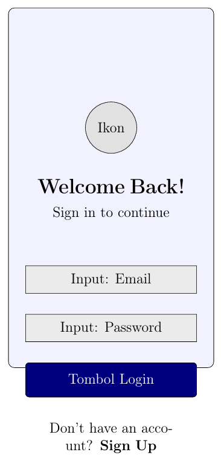

## 3. Implementasi Kode Flutter

Dari desain yang telah ada sebelumnya, berikut merupakan implementasi kodenya:

### 3.1 Struktur Proyek

Untuk membuat kode yang sesuai dan bisa diolah, yang pertama dilakukan adalah dengan membuat struktur proyek terlebih dahulu. Disini saya akan membuat beberapa susunan file seperti main, login, register, home page serta file yang digunakan untuk menyimpan data user. Berikut adalah susunan yang telah saya buat:\
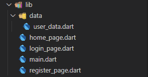

### 3.2 Kode main.dart

Setelah membuat struktur proyek seperti diatas, selanjutnya saya akan membuat kode dari file main. file main ini digunakan sebagai titik masuk dari program, berikut kodenya:

    import 'package:flutter/material.dart';
    import 'package:login_register/login_page.dart';
    import 'package:google_fonts/google_fonts.dart';

    void main() {
    runApp(const MyApp());
    }

    class MyApp extends StatelessWidget {
    const MyApp({super.key});

    @override
    Widget build(BuildContext context) {
        return MaterialApp(
        title: 'Flutter Login UI',
        theme: ThemeData(
            primarySwatch: Colors.blue,
            textTheme: GoogleFonts.poppinsTextTheme(
            Theme.of(context).textTheme,
            ),
        ),
        debugShowCheckedModeBanner: false,
        home: LoginPage(),
        );
    }
    }

### 3.3 Kode data/user.dart

Setelah membuat file main seperti diatas, selanjutnya saya mencoba membuat kode dari user, pada user_data.dart ini berisi informasi akun user yang mana seperti database yang digunakan untuk menyimpan. disini keynya sendiri adalah email, sehingga nanti email ini yang digunakan sebagai identifikasi akun. berikut adalah kodenya:

    Map<String, Map<String, String>> userData = {
    'dinofeb152@gmail.com': {
        'fullName': 'Dino Febiyan',
        'password': 'dinoganzzz152',
    },
    };

### 3.4 Kode register_page.dart

Selanjutnya adalah kode dari register. register ini digunakan untuk user mendaftarkan akun sehingga didalamnya akan berisi inputan berupa form seperti email, fullname serta ppassword. Berikut adalah kodenya:

    import 'package:flutter/material.dart';
    import 'package:login_register/data/user_data.dart';

    class RegisterPage extends StatefulWidget {
    const RegisterPage({super.key});

    @override
    _RegisterPageState createState() => _RegisterPageState();
    }

    class _RegisterPageState extends State<RegisterPage> {
    final _fullNameController = TextEditingController();
    final _emailController = TextEditingController();
    final _passwordController = TextEditingController();

    void _register() {
        String fullName = _fullNameController.text;
        String email = _emailController.text;
        String password = _passwordController.text;

        if (fullName.isNotEmpty && email.isNotEmpty && password.isNotEmpty) {
        userData[email] = {
            'fullName': fullName,
            'password': password,
        };

        showDialog(
            context: context,
            builder: (context) => AlertDialog(
            title: Text('Registrasi Berhasil'),
            content: Text('Akun Anda telah dibuat. Silakan login.'),
            actions: [
                TextButton(
                onPressed: () {
                    Navigator.pop(context); // Tutup dialog
                    Navigator.pop(context); // Kembali ke halaman login
                },
                child: Text('OK'),
                ),
            ],
            ),
        );
        } else {
        showDialog(
            context: context,
            builder: (context) => AlertDialog(
            title: Text('Registrasi Gagal'),
            content: Text('Harap isi semua kolom.'),
            actions: [
                TextButton(
                onPressed: () => Navigator.pop(context),
                child: Text('OK'),
                ),
            ],
            ),
        );
        }
    }

    @override
    Widget build(BuildContext context) {
        return Scaffold(
        body: Container(
            padding: const EdgeInsets.symmetric(horizontal: 24.0),
            decoration: BoxDecoration(
            gradient: LinearGradient(
                colors: [Color(0xFF6DD5FA), Color(0xFF2980B9)],
                begin: Alignment.topLeft,
                end: Alignment.bottomRight,
            ),
            ),
            child: Center(
            child: SingleChildScrollView(
                child: Column(
                mainAxisAlignment: MainAxisAlignment.center,
                crossAxisAlignment: CrossAxisAlignment.stretch,
                children: <Widget>[
                    Icon(Icons.person_add_alt_1, size: 80, color: Colors.white),
                    SizedBox(height: 20),
                    Text(
                    'Create Account',
                    textAlign: TextAlign.center,
                    style: TextStyle(
                        color: Colors.white,
                        fontSize: 32,
                        fontWeight: FontWeight.bold,
                    ),
                    ),
                    SizedBox(height: 40),
                    TextField(
                    controller: _fullNameController,
                    decoration: InputDecoration(
                        hintText: 'Full Name',
                        filled: true,
                        fillColor: Colors.white.withOpacity(0.9),
                        prefixIcon: Icon(Icons.person),
                        border: OutlineInputBorder(
                        borderRadius: BorderRadius.circular(12),
                        borderSide: BorderSide.none,
                        ),
                    ),
                    ),
                    SizedBox(height: 20),
                    TextField(
                    controller: _emailController,
                    keyboardType: TextInputType.emailAddress,
                    decoration: InputDecoration(
                        hintText: 'Email',
                        filled: true,
                        fillColor: Colors.white.withOpacity(0.9),
                        prefixIcon: Icon(Icons.email),
                        border: OutlineInputBorder(
                        borderRadius: BorderRadius.circular(12),
                        borderSide: BorderSide.none,
                        ),
                    ),
                    ),
                    SizedBox(height: 20),
                    TextField(
                    controller: _passwordController,
                    obscureText: true,
                    decoration: InputDecoration(
                        hintText: 'Password',
                        filled: true,
                        fillColor: Colors.white.withOpacity(0.9),
                        prefixIcon: Icon(Icons.lock),
                        border: OutlineInputBorder(
                        borderRadius: BorderRadius.circular(12),
                        borderSide: BorderSide.none,
                        ),
                    ),
                    ),
                    SizedBox(height: 30),
                    ElevatedButton(
                    onPressed: _register,
                    style: ElevatedButton.styleFrom(
                        padding: EdgeInsets.symmetric(vertical: 16),
                        backgroundColor: Colors.white,
                        foregroundColor: Colors.blue.shade700,
                        shape: RoundedRectangleBorder(
                        borderRadius: BorderRadius.circular(12),
                        ),
                    ),
                    child: Text('Register', style: TextStyle(fontSize: 18)),
                    ),
                    Row(
                    mainAxisAlignment: MainAxisAlignment.center,
                    children: [
                        Text("Already have an account?",
                            style: TextStyle(color: Colors.white70)),
                        TextButton(
                        onPressed: () => Navigator.pop(context),
                        child: Text(
                            'Sign In',
                            style: TextStyle(
                                color: Colors.white, fontWeight: FontWeight.bold),
                        ),
                        ),
                    ],
                    ),
                ],
                ),
            ),
            ),
        ),
        );
    }
    }

### 3.5 Kode login_page.dart

Setelah register, selanjutnya adalah login. Login ini digunakan untuk pengguna melakukan autentikasi sehingga didalamnya terdapat validasi data berdasarkan data yang ada didalam user data. Berikut adalah kodenya:

    import 'package:flutter/material.dart';
    import 'package:login_register/register_page.dart';
    import 'package:login_register/home_page.dart';
    import 'package:login_register/data/user_data.dart';

    class LoginPage extends StatefulWidget {
    const LoginPage({super.key});

    @override
    _LoginPageState createState() => _LoginPageState();
    }

    class _LoginPageState extends State<LoginPage> {
    final _emailController = TextEditingController();
    final _passwordController = TextEditingController();

    void _login() {
        String email = _emailController.text;
        String password = _passwordController.text;

        if (userData.containsKey(email) && userData[email]!['password'] == password) {
        Navigator.pushReplacement(
            context,
            MaterialPageRoute(
            builder: (context) => HomePage(
                fullName: userData[email]!['fullName']!,
            ),
            ),
        );
        } else {
        showDialog(
            context: context,
            builder: (context) {
            return AlertDialog(
                title: Text('Login Gagal'),
                content: Text('Email atau password salah.'),
                actions: [
                TextButton(
                    onPressed: () => Navigator.pop(context),
                    child: Text('OK'),
                ),
                ],
            );
            },
        );
        }
    }

    @override
    Widget build(BuildContext context) {
        return Scaffold(
        body: Container(
            padding: const EdgeInsets.symmetric(horizontal: 24.0),
            decoration: BoxDecoration(
            gradient: LinearGradient(
                colors: [Colors.blue.shade200, Colors.blue.shade400],
                begin: Alignment.topLeft,
                end: Alignment.bottomRight,
            ),
            ),
            child: Center(
            child: SingleChildScrollView(
                child: Column(
                mainAxisAlignment: MainAxisAlignment.center,
                crossAxisAlignment: CrossAxisAlignment.stretch,
                children: <Widget>[
                    Icon(Icons.lock_person, size: 80, color: Colors.white),
                    SizedBox(height: 20),
                    Text(
                    'Welcome Back!',
                    textAlign: TextAlign.center,
                    style: TextStyle(
                        color: Colors.white,
                        fontSize: 32,
                        fontWeight: FontWeight.bold,
                    ),
                    ),
                    SizedBox(height: 40),
                    TextField(
                    controller: _emailController,
                    keyboardType: TextInputType.emailAddress,
                    decoration: InputDecoration(
                        hintText: 'Email',
                        filled: true,
                        fillColor: Colors.white.withOpacity(0.9),
                        prefixIcon: Icon(Icons.email),
                        border: OutlineInputBorder(
                        borderRadius: BorderRadius.circular(12),
                        borderSide: BorderSide.none,
                        ),
                    ),
                    ),
                    SizedBox(height: 20),
                    TextField(
                    controller: _passwordController,
                    obscureText: true,
                    decoration: InputDecoration(
                        hintText: 'Password',
                        filled: true,
                        fillColor: Colors.white.withOpacity(0.9),
                        prefixIcon: Icon(Icons.lock),
                        border: OutlineInputBorder(
                        borderRadius: BorderRadius.circular(12),
                        borderSide: BorderSide.none,
                        ),
                    ),
                    ),
                    SizedBox(height: 30),
                    ElevatedButton(
                    onPressed: _login,
                    style: ElevatedButton.styleFrom(
                        padding: EdgeInsets.symmetric(vertical: 16),
                        backgroundColor: Colors.white,
                        foregroundColor: Colors.blue.shade700,
                        shape: RoundedRectangleBorder(
                        borderRadius: BorderRadius.circular(12),
                        ),
                    ),
                    child: Text('Login', style: TextStyle(fontSize: 18)),
                    ),
                    Row(
                    mainAxisAlignment: MainAxisAlignment.center,
                    children: [
                        Text("Don’t have an account?",
                            style: TextStyle(color: Colors.white70)),
                        TextButton(
                        onPressed: () {
                            Navigator.push(
                            context,
                            MaterialPageRoute(builder: (context) => RegisterPage()),
                            );
                        },
                        child: Text(
                            'Sign Up',
                            style: TextStyle(
                                color: Colors.white, fontWeight: FontWeight.bold),
                        ),
                        ),
                    ],
                    ),
                ],
                ),
            ),
            ),
        ),
        );
    }
    }

### 3.6 Kode home_page.dart

Setelah pengguna berhasil melakukan login, selanjutnya pengguna akan dipindahkan ke halaman baru yang mana halaman tersebut adalah homepage. karena disini percobaan jadi disini nantinya hanya akan memberikan kalimat selamat datang saja. Berikut adalah kodenya:

    import 'package:flutter/material.dart';
    import 'package:login_register/login_page.dart';

    class HomePage extends StatelessWidget {
    final String fullName;

    const HomePage({super.key, required this.fullName});

    @override
    Widget build(BuildContext context) {
        return Scaffold(
        appBar: AppBar(
            title: Text('Home Page'),
            backgroundColor: Colors.blue.shade700,
            actions: [
            IconButton(
                icon: Icon(Icons.logout),
                onPressed: () {
                Navigator.pushAndRemoveUntil(
                    context,
                    MaterialPageRoute(builder: (context) => LoginPage()),
                    (Route<dynamic> route) => false,
                );
                },
            )
            ],
        ),
        body: Container(
            decoration: BoxDecoration(
            gradient: LinearGradient(
                colors: [Colors.blue.shade100, Colors.white],
                begin: Alignment.topCenter,
                end: Alignment.bottomCenter,
            ),
            ),
            child: Center(
            child: Column(
                mainAxisAlignment: MainAxisAlignment.center,
                children: [
                CircleAvatar(
                    radius: 50,
                    backgroundColor: Colors.blue.shade700,
                    child: Icon(Icons.person, size: 50, color: Colors.white),
                ),
                SizedBox(height: 20),
                Text(
                    'Selamat Datang,',
                    style: TextStyle(fontSize: 24, color: Colors.grey.shade700),
                ),
                SizedBox(height: 10),
                Text(
                    fullName,
                    style: TextStyle(
                    fontSize: 32,
                    fontWeight: FontWeight.bold,
                    color: Colors.blue.shade800,
                    ),
                    textAlign: TextAlign.center,
                ),
                ],
            ),
            ),
        ),
        );
    }
    }

## 4. Hasil, Kesimpulan dan Latihan Tambahan
Dari praktikum yang telah dilakukan diatas, bisa didapatkan poin poin seperti berikut:

### 4.1 Hasil Kode

Dari Kode yang sudah dibuat diatas, berikut adalah hasil programnya ketika saja jalankan di emulator:

- Halaman Login\
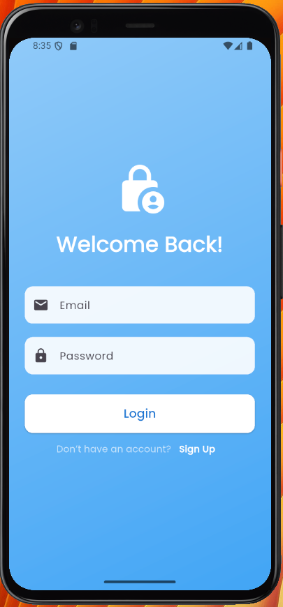
- Percobaan Mengisi Form Login\
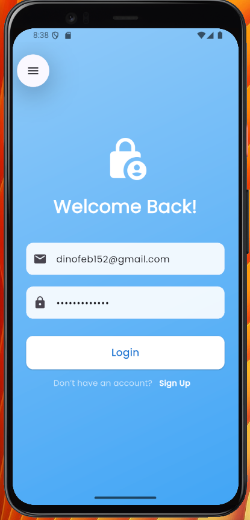
- Halaman HomePage\
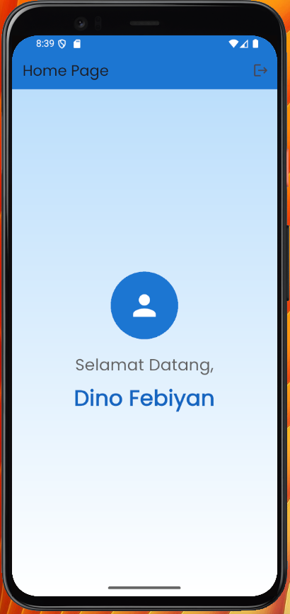
- Halaman Register\
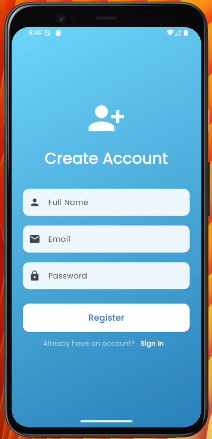
- Percobaan Mengisi Form Register\
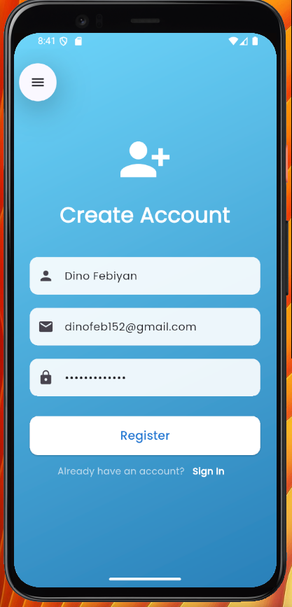
- Status Ketika Gagal\
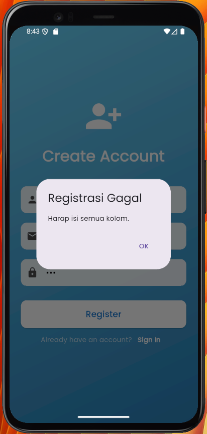
- Status Ketika Berhasil\
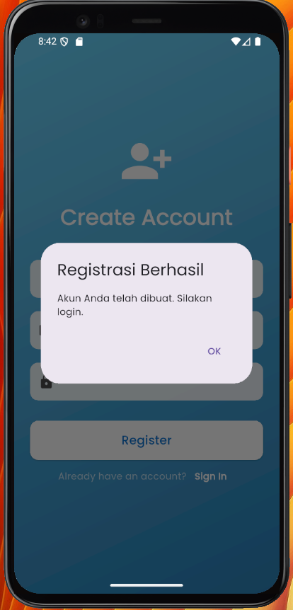
### 4.2 Latihan Tambahan
Untuk meningkatkan pengalaman dan agar semakin memperdalam keahlian saya, disini saya akan mengerjakan beberapa latihan tambahan seperti berikut:
#### 4.2.1 Validasi Input
Latihan pertama yang saya lakukan yaitu menambahkan validasi input, disini saya menambahkan validasi di input form register yaitu validasi bahwa email harus ada `@` dan password harus memiliki minimal panjang 6 karakter. Jika tidak, maka program akan memberikan notifikasi. Berikut adalah kodenya:
    if (!email.contains('@')) {
        showDialog(
            context: context,
            builder: (context) => AlertDialog(
            title: Text('Email Tidak Valid'),
            content: Text('Email harus mengandung "@"'),
            actions: [
                TextButton(
                onPressed: () => Navigator.pop(context),
                child: Text('OK'),
                ),
            ],
            ),
        );
        return;
        }

        if (password.length < 6) {
        showDialog(
            context: context,
            builder: (context) => AlertDialog(
            title: Text('Password Tidak Valid'),
            content: Text('Password minimal 6 karakter'),
            actions: [
                TextButton(
                onPressed: () => Navigator.pop(context),
                child: Text('OK'),
                ),
            ],
            ),
        );
        return;
        }
Dari kode diatas jika dicoba maka akan seperti berikut:
- Jika email tidak mengandung `@`:\
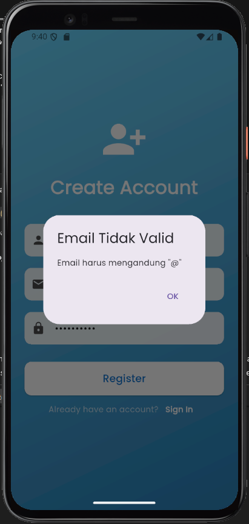
- Jika password tidak memiliki panjang 6 karakter:\
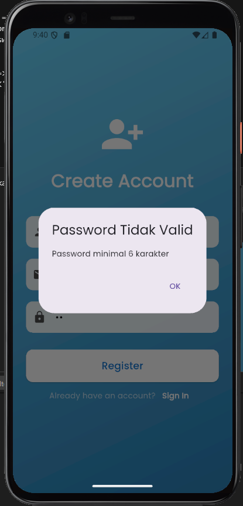
#### 4.2.2 Tampilkan dan Sembunyikan Password
Latihan selanjutnya yang saya lakukan adalah menampilkan dan menyembunyikan password, konsep ini memang sering digunakan pada form input untuk login atau register. Berikut adalah kodenya:

      suffixIcon: IconButton(
                      icon: Icon(
                        _obscurePassword ? Icons.visibility_off : Icons.visibility,
                      ),
                      onPressed: () {
                        setState(() {
                          _obscurePassword = !_obscurePassword;
                        });
                      },
                    ),

Dari kode tersebut jika dijalankan dan dicek diemulator maka akan seperti berikut:
- Menyembunyikan password\
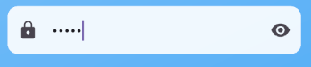
- Menampilkan password\
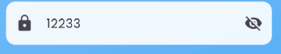
#### 4.2.3 Animasi Sederhana
Latihan yang selanjutnya saya lakukan adalah menggunakan hero widget, dengan menggunakan ini, akan membuat animasi pada icon menjadi lebih halus. Berikut adalah kode yang saya gunakan:

    Hero(
    tag: 'logo',
    child: Icon(Icons.lock_person, size: 80, color: Colors.white),
    ),
kode tersebut saya terapkan di login dan register sehingga akan menghasilkan animasi seperti berikut:\
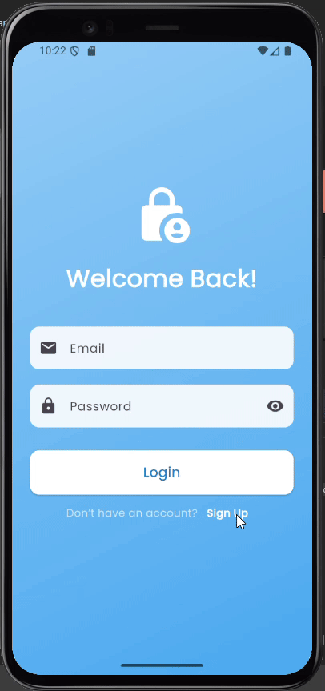
#### 4.2.4 Simpan Sesi Login
Latihan terakhir yang saya lakukan adalah mencoba untuk membuat kode untuk menyimpan sesi login. Disini saya menggunakan package `shared_preferences` untuk menyimpan status login. sehingga saat user masuk ke aplikasi namun sudah login jadi user tersebut tidak perlu login lagi.
Langkah pertama yang saya lakukan adalah dengan menambahkan dependencie seperti berikut:
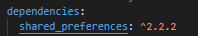
setelah menambahkan dependency seperti diatas, selanjutnya saya akan mencoba untuk melajukan pub get untuk memperbarui package flutter seperti berikut:\
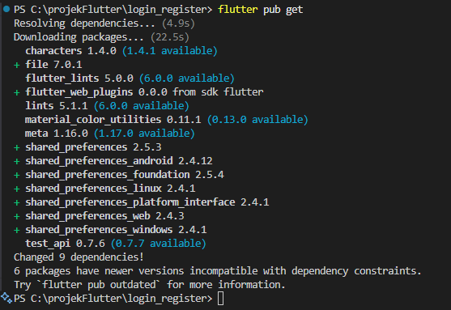
setelah melakukan pubget seperti diatas, selanjutnya saya akan membuat kode untuk menyimpan status login pada file `login page.dart` seperti berikut:

    SharedPreferences prefs = await SharedPreferences.getInstance();
        await prefs.setBool('isLoggedIn', true);
        await prefs.setString('fullName', userData[email]!['fullName']!);
kode diatas digunakan untuk menyimpan status login, dimana dengan ini maka meskipun aplikasinya ditutup user tetap bisa masuk aplikasi tanpa perlu login ulang.\
Setelah membuat kode tersebut selanjutnya saya membuat kode untuk mengecek status login pada `main.dart` seperti berikut:

    Future<Widget> _getInitialPage() async {
        SharedPreferences prefs = await SharedPreferences.getInstance();
        bool isLoggedIn = prefs.getBool('isLoggedIn') ?? false;
        String fullName = prefs.getString('fullName') ?? '';
        if (isLoggedIn) {
        return HomePage(fullName: fullName);
        } else {
        return LoginPage();
        }
    }
Setelah itu, disini saya juga akan menambahkan tombol untuk logout di `homepage`, sehingga penngguna bisa logout. Sehingga ketika membuka aplikasi lagi maka pengguna akan login terlebih dahulu, berikut kodenya:

    icon: Icon(Icons.logout),
            onPressed: () async {
              SharedPreferences prefs = await SharedPreferences.getInstance();
              await prefs.clear();
    }
dengan ini maka pengguna akan bisa logout untuk mengakhiri sesi.\
Dari kode kode diatas, berikut saya tampilkan hasilnya:\
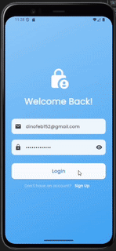
### 4.2 Kesimpulan
Dari praktikum ini, saya berhasil membuat sebuah aplikasi Flutter sederhana yang memiliki fitur login dan registrasi. Dalam proses pengerjaan, saya mempelajari bagaimana membangun UI menggunakan widget-widget dasar Flutter seperti Scaffold, Container, TextField, dan ElevatedButton. Saya juga memahami cara mengelola input pengguna dengan TextEditingController, serta bagaimana mengatur navigasi antar halaman menggunakan Navigator.

Selain itu, saya belajar bagaimana cara menyimpan data pengguna secara sementara dalam variabel global (Map), dan bagaimana cara mengirim data antar halaman melalui constructor. Praktikum ini membantu saya memahami alur dasar pembuatan aplikasi dengan autentikasi sederhana, mulai dari desain wireframe, implementasi kode, hingga menguji aplikasi agar dapat berjalan dengan baik.

Dengan menyelesaikan praktikum ini, saya merasa lebih percaya diri dalam menggunakan Flutter, terutama dalam hal membuat antarmuka yang interaktif serta memahami konsep navigasi dan pengelolaan state sederhana.